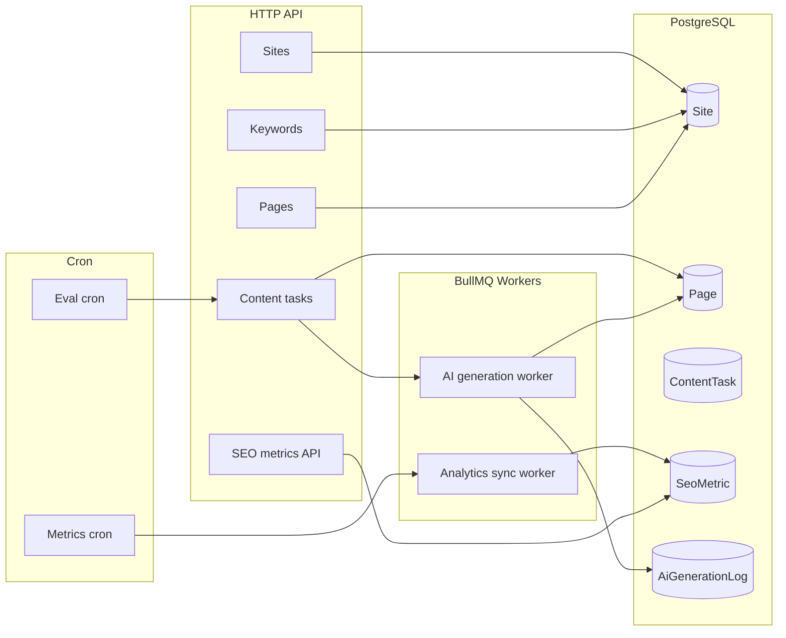

# Traffic Engine Backend — Domain & Responsibilities

This NestJS application is the **SEO / organic traffic automation engine** for Sindibed: it models **sites**, **keywords**, and **pages**, runs a **configurable multi-step AI pipeline** to generate and refine content, stores **SEO metrics** and **AI usage logs**, and schedules **analytics sync** and **underperformance-driven rewrites**. The HTTP API is served under the global prefix **`/api/v1`** (see `src/main.ts`).

---

## What problem it solves

- **Operationalize SEO content at scale**: turn a keyword + site into a draft page, score it, optimize in a loop, and persist structured outputs (outline, draft, final content, scores).
- **Per-site control**: each `Site` can define its own **AI pipeline** (providers, models, prompt templates, version).
- **Async work**: heavy generation runs on **BullMQ** workers (`Redis`), not blocking HTTP requests.
- **Measurement hooks**: daily jobs enqueue **metrics sync**; an evaluator can **queue rewrites** when published pages underperform on CTR.

---

## Core domain model (Prisma)

Relationships are centered on **`Site`**:

| Entity | Role |
|--------|------|
| **Site** | Tenant for one web property: `domain` (unique), `timezone`, `status`, optional `gscProperty` / `ga4PropertyId`, content `strategy`, `defaultLanguage`, `languages[]`, and **`aiPipeline` (JSON)** for the generation pipeline config. |
| **Keyword** | Search term scoped to a site: `keyword` + `language` (unique per site), intent, priority, optional metrics (`searchVolume`, `difficulty`, `cpc`). **`baseKeywordId`** links variants into a **cluster** (self-relation). |
| **Page** | A URL-bound asset for a keyword: `slug`, `language`, SEO fields (`metaTitle`, `metaDescription`), AI outputs (`outline` JSON, `rawDraft`, `finalContent`), `schemaMarkup`, `status`, **`seoScore`**, **`readabilityScore`**, **`wordCount`**, **`optimizationCount`**, timestamps. |
| **ContentTask** | Work unit: `type` (e.g. `GENERATE_CONTENT`, `REWRITE_CONTENT`), `status`, optional links to `pageId` / `keywordId`, locking fields for workers (`lockedAt`, `lockedBy`, `currentStep`). |
| **SeoMetric** | Time-series row: `date`, optional `pageId`, impressions, clicks, CTR, avg position, organic sessions, bounce rate — keyed by `(siteId, pageId, date)`. |
| **KeywordResearch** | Stored research batches: `seedKeyword`, `language`, `suggestions[]`, `source` (Phase 2 currently allows **MANUAL** only). |
| **AiGenerationLog** | Per pipeline **step** audit: provider, model, tokens, approximate **cost**, duration, **prompt hash**, success/failure — tied to `pageId`. |

Enums worth remembering: `ContentLanguage`, `ContentStrategy`, `KeywordIntent`, `PageStatus`, `TaskType`, `TaskStatus`, `AiProvider`, `KeywordResearchSource`.

Full definitions: `prisma/schema.prisma`.

---

## AI content pipeline (business flow)

Configuration lives on **`Site.aiPipeline`**: JSON with `version` (number ≥ 1) and `steps[]`. Each step has **`stepKey`**, **`provider`** (`openai` | `anthropic` | `google`), **`model`**, **`promptTemplateId`**, and optional `temperature`, `maxOutputTokens`, `timeoutMs`.

**Validation** (`ContentGenerationPipelineService.parsePipeline`):

- At least **3** steps; **unique** `stepKey` values.
- Providers must be one of the three enums above.
- The runnable pipeline **must include these exact step keys**: `outline`, `draft`, `analyze`, `optimize` (additional custom steps are not enough; these four are required).

**Execution order** (`ContentGenerationPipelineService.runForPage`):

1. **outline** — builds an SEO outline; result is parsed as JSON when possible and stored on `Page.outline`.
2. **draft** — long-form article from the outline; stored in `Page.rawDraft` with `wordCount`.
3. **analyze** — returns JSON with `seoScore`, `readabilityScore`, `wordCount`, `issues`; updates `Page` analysis fields.
4. **optimize** loop — while `seoScore` is **below 70** (`SEO_SCORE_OPTIMIZE_THRESHOLD`), and within **2** optimization cycles (`MAX_OPTIMIZATION_LOOPS` / per-page `optimizationCount` cap), the **optimize** step revises the draft; then **analyze** runs again.
5. Final text is written to **`Page.finalContent`**.

**Prompt templates** are resolved in code (`PromptTemplateRegistry`): built-in IDs include `outline_v1`, `draft_v1`, `analyze_v1`, `optimize_v1`. Unknown `promptTemplateId` → HTTP 404 from the registry.

**SEO brief** (`SeoBriefBuilder`) currently passes: site name, domain, keyword language, keyword string — used to build prompts per step.

**Orchestration** (`AiOrchestratorService`):

- **`AI_STUB=true`**: returns deterministic stub text/JSON (no external API keys). Useful for local dev and CI-like runs.
- Otherwise calls the configured provider via `AiProviderRegistry`; on certain failures it may **retry with a fallback provider** (OpenAI → Anthropic → Google) using env fallback models.

**Cost logging**: token counts are logged; `cost` in `AiGenerationLog` is a simplified placeholder formula from token totals (see pipeline `log()` helper).

---

## HTTP API surface (relative to `/api/v1`)

| Area | Endpoints | Notes |
|------|-----------|--------|
| **Sites** | `POST/GET /sites`, `GET/PATCH /sites/:id`, `PATCH /sites/:id/ai-pipeline` | Create/update site; **versioned pipeline** update with validated DTO (`PatchAiPipelineDto`: min 3 steps, nested step validation). |
| **Keywords** | `POST /keywords`, `GET /keywords?siteId=`, `GET /keywords/cluster?baseKeywordId=`, `GET/PATCH /keywords/:id` | Cluster query returns grouped keywords sharing a base. |
| **Pages** | `POST /pages`, `GET /pages?siteId=&status=&language=`, `GET/PATCH /pages/:id` | Page ties `keywordId`; unique per `(siteId, slug, language)`. |
| **Content tasks** | `POST /content-tasks`, `GET /content-tasks`, `GET /content-tasks?siteId=`, `GET /content-tasks/:id` | Creating a task with **`pageId`** enqueues AI generation (see queues). |
| **Keyword research** | `POST /keyword-research`, `GET /keyword-research` | **`source` must be `MANUAL`** in Phase 2. |
| **SEO metrics** | `POST /seo-metrics`, `POST /seo-metrics/bulk`, `GET /seo-metrics?siteId=&days=` | Upsert and query metrics for dashboards or external ingest. |

Controllers live under `src/modules/traffic-engine/*/controllers/`.

---

## Background jobs & queues (BullMQ)

Redis connection: `REDIS_URL` (see `InfrastructureQueueModule`).

| Queue name | Job name | Purpose |
|------------|----------|---------|
| `traffic-engine.ai.generate` | `traffic-engine.ai.process` | Runs **`ContentGenerationPipelineService`** for a `pageId`; optional `contentTaskId` for task lifecycle updates. |
| `traffic-engine.analytics.sync` | `traffic-engine.analytics.run` | Runs **`AnalyticsIngestionService`** — all sites or a single `siteId` if present in payload. |

**Enqueue rules**:

- **`ContentTasksService`**: when a task is created with `pageId`, it adds an AI job with **`jobId = pageId`** (deduplication: if a job with that id already exists, it skips).

**Worker behavior** (`AiGenerationProcessor`):

- If `contentTaskId` is set: only processes tasks in **`QUEUED`**; atomically transitions to **`PROCESSING`**; on success the pipeline marks the task **`COMPLETED`**; on failure **`FAILED`** with `errorLog`.

Legacy constants in `queue.constants.ts` mention `traffic-engine.content.generate` — marked as **legacy**; new work should use **`TRAFFIC_ENGINE_AI_QUEUE`**.

---

## Scheduled cron jobs

`TrafficEngineSchedulerService` (`@nestjs/schedule`):

| Job | Default cron (overridable by env) | Behavior |
|-----|-----------------------------------|----------|
| Metrics enqueue | `METRICS_INGESTION_CRON` default `0 2 * * *` | Adds global analytics sync job (`jobId`: `traffic-engine.metrics.global`). |
| Performance evaluation | `PERFORMANCE_EVAL_CRON` default `0 4 * * *` | For **each site**, runs `PerformanceEvaluatorService.evaluateSite`. |

**Performance evaluation** (`PerformanceEvaluatorService`):

- Finds **published** pages older than `UNDERPERFORM_DAYS_OLD` (default 30 days).
- If the latest **`SeoMetric`** for the page shows **CTR &lt; `UNDERPERFORM_CTR_THRESHOLD`** (default `0.02`) and `finalContent` exists, creates a **`REWRITE_CONTENT`** task and enqueues the AI job (same `jobId = pageId` rule).

Note: `UNDERPERFORM_POSITION_THRESHOLD` is in `.env.example` but is **not referenced** in the evaluator service code as of this writing — CTR is what triggers rewrites.

---

## Analytics ingestion (current behavior)

`AnalyticsIngestionService.syncSiteMetrics` is a **placeholder**:

- If GSC/GA4 env vars are missing, it logs a warning.
- It ensures a **daily site-level row** (`pageId: null`) exists for “today” in UTC (create or trivial update).

Real GSC/GA4 pulls would extend this layer; `Site.gscProperty` / `Site.ga4PropertyId` are persisted for when that integration ships.

---

## Infrastructure dependencies

| Dependency | Usage |
|------------|--------|
| **PostgreSQL** | Prisma persistence (`DATABASE_URL`). |
| **Redis** | BullMQ queues and workers. |
| **AI APIs** | OpenAI, Anthropic, Google AI — optional when `AI_STUB=true`. |

Default **HTTP port**: `3001` if `PORT` is unset.

---

## Mental model summary

In one sentence: **the Traffic Engine backend owns the lifecycle from “site + keyword + page” through AI-assisted drafting and scoring, persists operational and cost metadata, and hooks scheduled metrics and CTR-based refresh loops.**

---

## Phase 3 (Production Upgrade)

Phase 3 introduces a production-grade, cost-aware architecture on top of the existing pipeline:

- **Config system**: `SiteConfig` persisted in PostgreSQL and cached in Redis (`SiteConfigService`) for per-site runtime behavior and budget limits.
- **Prompt composition engine**: dynamic prompt composition (global + site-specific + runtime context) with Redis caching and optional A/B variant selection.
- **AI execution layer**: centralized `AiExecutionService` with budget guards (`CostControllerService`), model routing (`AiModelRouterService`), token estimation, and per-step AI logs.
- **State-machine pipeline**: `TrafficEnginePipelineService` with statuses (`PENDING`, `GENERATING`, `VALIDATING`, `ANALYZING`, `REWRITING`, `READY`, `FAILED`, `PARTIALLY_COMPLETED`, `SKIPPED_STEP`), step retries, and checkpoint resume (`PipelineCheckpointService`).
- **Deterministic intelligence layer**: intent classification, semantic scoring (intent match/content depth/redundancy/gaps), and policy validation without extra AI calls.
- **Frontend contract layer**: Next.js-ready versioned content response via `GET /api/v1/content/:pageId` and logs endpoint `GET /api/v1/content/:pageId/logs`.
