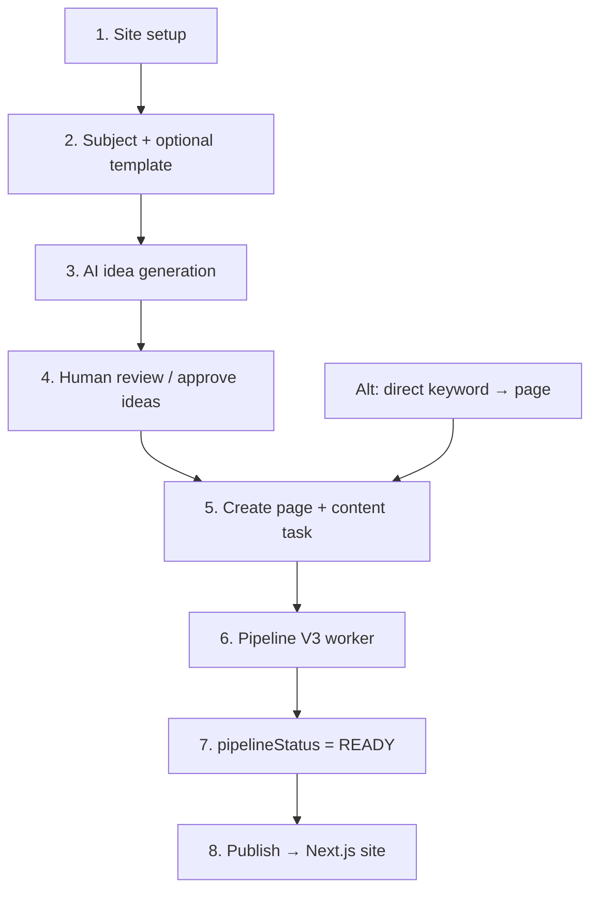

# Content Creation Flow (0 → 100)

Short reference for how Sindibed creates SEO content end-to-end, and which AI is involved at each stage.

**System:** `traffic-engine-backend` (NestJS) + BullMQ workers + Next.js frontend via webhooks.

---

## Overview

There are **two entry paths**:

| Path | When to use |
|------|-------------|
| **Subject → Ideas → Page** | Planned content batches (topics, templates, editorial review) |
| **Keyword → Page → Generate** | One-off or bulk generation from existing keywords |

---

## Step-by-step (0 → 100)

### 0–10 · Foundation

| Step | What happens |
|------|----------------|
| **Create Site** | Domain, languages, `autoPublish`, webhook URL for the frontend |
| **Configure SiteConfig** | Per-site AI models, budget limits, quality thresholds, runtime flags (analysis, rewrite, images, SEO check) |
| **Optional Template** | Formatting rules, SEO rules, internal-linking rules injected into prompts |
| **Create Subject** | Topic cluster: primary/secondary keywords, language, optional template link |

### 10–30 · Ideation (AI)

| Step | What happens |
|------|----------------|
| **Generate ideas** | `POST /subjects/:id/ideas/generate` — async job |
| **AI output** | Batch of `ContentIdea` rows: title, slug, target keyword, outline, meta, intent |
| **Review** | Approve, reject, or request revision |

**AI used:** configurable provider (default **Google Gemini**).

| Provider | Default model |
|----------|---------------|
| Google | `gemini-3.1-flash-lite` |
| OpenAI | `gpt-4o-mini` |
| Anthropic | `claude-3-5-haiku-20241022` |

Ideas are validated for hallucination risk; low-confidence ideas may start as `PENDING_REVIEW`.

### 30–40 · Page & task creation

When an idea is **APPROVED**:

1. Upsert **Keyword** for the target term
2. Create **Page** (slug, title, meta, optional pre-filled outline) — `pipelineStatus: PENDING`
3. Create **ContentTask** + **IdeaTask**
4. Enqueue BullMQ job on `traffic-engine.ai.generate`

**Alt path:** create keyword + page directly, then `POST /pages/:id/generate-content` or `POST /content-tasks`.

### 40–90 · Pipeline V3 (main AI pipeline)

Worker runs `TrafficEnginePipelineService` with checkpoint resume on failure.

| # | Step | AI? | What it does |
|---|------|-----|--------------|
| 1 | **generate** | ✅ | SEO brief → outline (JSON) → full article draft (markdown) |
| 2 | **validate** | ❌ | Policy checks + originality vs. existing site pages |
| 3 | **analyze** | ✅ | SEO/readability/E-E-A-T scores + deterministic coverage scoring |
| 4 | **geo_score** | ❌ | GEO score + JSON-LD schema markup |
| 5 | **adversarial_stress_test** | ✅ (conditional) | Rewrite if GEO score &lt; 60 and anti-patterns detected |
| 6 | **rewrite** | ✅ (conditional) | Improve draft if scores below site quality threshold |
| 7 | **image_generation** | ✅ | Hero image via **Google Imagen** |
| 8 | **seo_check** | ✅ | SEO gate + **Gemini 2.5 Pro** YMYL audit & fix pass |
| 9 | **internal_linking** | ❌ | Inject internal links from site graph |
| 10 | **final_geo_schema** | ❌ | Refresh schema/GEO on final body |

On success: `Page.finalContent` is set, `pipelineStatus → READY`, checkpoint cleared.

**Model routing:** per-site `SiteConfig.modelConfig`. Typical defaults:

| Step | Example model |
|------|---------------|
| generate / analyze / rewrite / seo_check | `gemini-2.0-flash` |
| image_generation | `imagen-4.0-generate-001` (code default) |
| High-priority keywords (priority ≥ 8, transactional/commercial) | `modelConfig.rules.highPriority` |
| Budget downgrade | `modelConfig.rules.fallback` |

Provider is inferred from model name (`claude` → Anthropic, `gemini` → Google, else OpenAI).

**Resilience:** transient provider errors fall back OpenAI → Anthropic → Google. Budget guards can skip analysis or reduce tokens. Set `AI_STUB=true` to run without external APIs (local dev).

### 90–100 · Publish & live

| Step | What happens |
|------|----------------|
| **Auto-publish** | If `site.autoPublish !== false`, publish fires automatically when pipeline completes |
| **Manual publish** | `POST /pages/:id/publish` |
| **Publish actions** | Render markdown → JSON, upload hero to CDN, set `status: PUBLISHED`, invalidate cache |
| **Webhook** | `page.published` / `page.updated` → Next.js ISR revalidation |

Human override: `POST /pages/:id/mark-content-ready` can force `READY` when content exists but pipeline ended in `FAILED` / `PARTIALLY_COMPLETED`.

Frontend reads live content via `GET /api/v1/content/:pageId` (site API key).

---

## AI stack summary

| Layer | Technology | Role |
|-------|------------|------|
| **LLM providers** | OpenAI, Anthropic, Google Gemini | Outline, draft, analysis, rewrite, SEO check, idea generation |
| **Image** | Google Imagen (`imagen-4.0-generate-001`) | Page hero images |
| **YMYL audit** | Gemini 2.5 Pro (`gemini-2.5-pro`) | E-E-A-T audit + content fix pass (hardcoded in audit service) |
| **Orchestration** | `AiExecutionService` + `AiOrchestratorService` | Prompt composition, model routing, cost logging, fallback |
| **Prompts** | `PromptCompositionEngine` | Site + global templates, tone, humanization, A/B variants |
| **Deterministic** | Policy engine, originality checker, GEO scorer, internal linker | Quality gates without extra AI calls |
| **Queue** | BullMQ + Redis | Async pipeline execution |
| **Audit trail** | `AiGenerationLog` | Per-step tokens, cost, model, duration |

---

## Post-publish loop (ongoing)

| Trigger | Action |
|---------|--------|
| Daily cron | Analytics sync job (GSC/GA4 placeholder today) |
| Performance eval cron | Published pages with low CTR → `REWRITE_CONTENT` task → pipeline re-run |

---

## Key statuses to watch

| Entity | Status | Meaning |
|--------|--------|---------|
| `ContentIdea` | `PENDING_REVIEW` → `APPROVED` | Ready to create a page task |
| `ContentTask` | `QUEUED` → `PROCESSING` → `COMPLETED` / `FAILED` | Worker lifecycle |
| `Page.pipelineStatus` | `PENDING` → … → `READY` | Content pipeline progress |
| `Page.status` | `DRAFT` → `PUBLISHED` | Live on site |

---

## Related docs

- `apps/traffic-engine-backend/DOMAIN.md` — domain model & legacy pipeline notes
- `apps/traffic-engine-backend/docs/ADMIN_PANEL_SPEC.md` — admin API workflows
- `apps/traffic-engine-backend/PROJECT_WORK_SUMMARY.md` — backend capabilities overview
