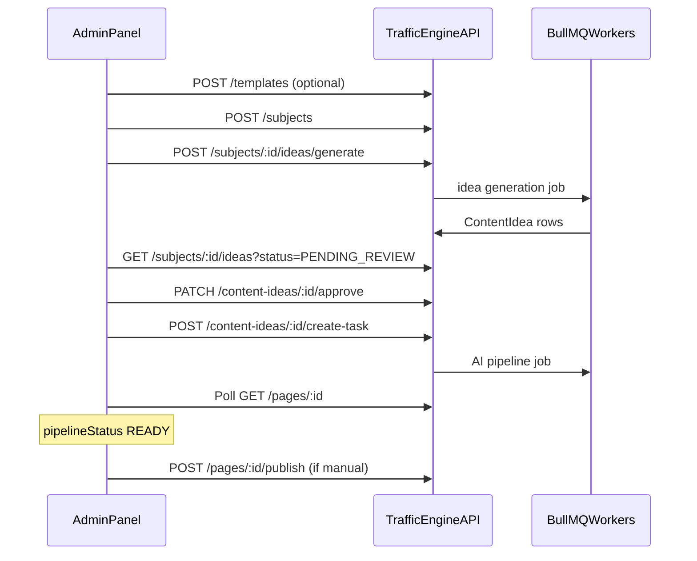

# Nestino / Traffic Engine — Admin Panel Build Spec

**Audience:** Frontend agent building the operator admin UI  
**Backend:** `apps/traffic-engine-backend` (NestJS)  
**API prefix:** `/api/v1`  
**Swagger (live):** `https://nestino-backend-production.up.railway.app/swagger`  
**Default local:** `http://localhost:3001`

This document is the single source of truth for building a panel to **create sites, plan SEO subjects, generate & approve ideas, run the AI pipeline, publish pages, and track status end-to-end**.

### Entity IDs (numeric)

All API entity IDs are **integers** (autoincrement), not CUID strings.

| Entity | Example route / field |
|--------|------------------------|
| Site | `/sites/1`, `siteId: 1` |
| Page | `/pages/42`, `pageId: 42` |
| Subject | `/subjects/3`, `subjectId: 3` |
| Keyword | `/keywords/10`, `keywordId: 10` |
| Content idea | `/content-ideas/7`, `ideaIds: [1, 2, 3]` |

Path and query params must be sent as numbers (e.g. `/pages/42`, not `/pages/cmp6zygd…`). JWT `sub` remains a **string** (`"1"`) per JWT spec; parse with `Number(sub)` when calling APIs that expect numeric user ids.

**Publish webhook** (`page.published` / `page.updated`) sends `{ pageId: number, siteId: number, slug, event, timestamp }`. Update Villa Silyan `NESTINO_SITE_ID` and any stored page references after deploy.

After production migration, export old→new mappings: `npx ts-node scripts/export-id-mapping.ts` → `id_mapping.json` (sites + pages).

---

## 1. What the panel must do (product goals)

| Goal | How the panel achieves it |
|------|---------------------------|
| Secure access | Login → store JWT → attach to every management request |
| Multi-site ops | Site switcher in header; all lists filtered by `siteId` |
| SEO campaign planning | Templates → Subjects → Generate ideas → Review queue |
| Content production | Approved idea → Create task → Track page pipeline → Publish |
| Direct / legacy path | Keywords → Pages → Queue generation (without subject pipeline) |
| Observability | Pipeline status, content tasks, AI logs, SEO metrics, strategy dashboards |
| Secrets handling | Show `contentApiKey` **once** on site create/rotate; never log JWT in analytics |

---

## 2. Authentication (required first)

### 2.1 Operator login (JWT)

All **management** endpoints require:

```http
Authorization: Bearer <accessToken>
```

| Method | Path | Auth | Body | Response |
|--------|------|------|------|----------|
| `POST` | `/identity/login` | **Public** | `{ "email": string, "password": string }` (password min 8) | `{ accessToken, expiresIn, user: { id, email, displayName, role } }` |
| `GET` | `/identity/me` | JWT | — | `{ id, email, displayName, role }` |

**Panel implementation:**

1. Login page → `POST /identity/login`
2. Store `accessToken` in memory + `sessionStorage` (or httpOnly cookie if you add a BFF later)
3. Axios/fetch interceptor adds `Authorization` header
4. On `401` → clear token → redirect to login
5. Optional: decode JWT `exp` client-side for session timeout warning

**Roles today:** `ADMIN` only (`PlatformRole` enum). Design UI for future roles.

### 2.2 Site content API key (NOT for the admin panel)

Frontends (e.g. Villa Silyan) use `X-Site-Api-Key` on **content read** routes. The admin panel uses **JWT** for those same reads if you call them from the panel (JWT works on management routes; content routes require site key).

For **preview in panel**, prefer:

- `GET /pages/:id` (JWT) — full page record including `finalContent`, `pipelineStatus`
- Or `GET /content/:pageId/preview` with site key if you store per-site key in panel state

| Method | Path | Auth | Notes |
|--------|------|------|-------|
| `GET` | `/content/:pageId` | `X-Site-Api-Key` | Next.js contract v2 |
| `GET` | `/content/:pageId/logs` | `X-Site-Api-Key` | AI step logs |
| `GET` | `/content/:pageId/preview` | `X-Site-Api-Key` | HTML/markdown preview |

### 2.3 Site API key lifecycle (panel: Site Settings)

| Event | API | Panel UX |
|-------|-----|----------|
| Create site | `POST /sites` | Modal: **“Copy content API key now — shown once”** |
| Rotate key | `POST /sites/:id/rotate-content-api-key` | Confirm dialog → show new key once |
| Store in panel | Local encrypted storage per `siteId` | For “Preview as frontend” feature only |

**Create site response shape:**

```json
{
  "site": { "id", "name", "domain", ... },
  "contentApiKey": "base64url-secret"
}
```

---

## 3. Recommended panel information architecture

```text
/login
/dashboard                          → KPIs: sites, pages in pipeline, ideas pending review
/sites                              → list
/sites/:siteId                      → tabs: Overview | Config | Subjects | Keywords | Pages | Tasks | SEO
/sites/:siteId/subjects             → subject list
/sites/:siteId/subjects/:subjectId  → ideas + generate
/sites/:siteId/ideas/review         → cross-subject review queue (filter PENDING_REVIEW)
/sites/:siteId/pages                → table with pipeline + publish actions
/sites/:siteId/pages/:pageId        → editor, preview, logs, publish
/templates                          → global templates CRUD
/keyword-research                   → optional research tool
```

**Global state (Zustand/Redux/React Query):**

- `accessToken`, `user`
- `activeSiteId` (persist last selected)
- `sites[]` (refetch on mount)

---

## 4. End-to-end workflows (copy into UI wizards)

### Workflow A — Full SEO pipeline (recommended)



| Step | User action | API |
|------|-------------|-----|
| 1 | Pick site (or create) | `POST /sites`, save `contentApiKey` |
| 2 | Configure engine | `POST` or `PATCH /site-configs/:siteId` |
| 3 | Create template (optional) | `POST /templates` |
| 4 | Create subject | `POST /subjects` |
| 5 | Generate ideas | `POST /subjects/:subjectId/ideas/generate` body: `{ "count": 10, "provider": "google" }` |
| 6 | Wait / refresh | `GET /subjects/:subjectId/ideas?status=PENDING_REVIEW` (poll every 5–10s) |
| 7 | Review | `PATCH /content-ideas/:id/approve` or `reject` or `request-revision` |
| 8 | Bulk approve | `POST /content-ideas/bulk-approve` body: `{ "ideaIds": [], "reviewNotes": "" }` |
| 9 | Start writing | `POST /content-ideas/:ideaId/create-task` |
| 10 | Track page | `GET /pages/:pageId` — watch `pipelineStatus`, `status` |
| 11 | Preview content | Page detail or `GET /content/:pageId/preview` + site key |
| 12 | Publish | Auto if `site.autoPublish` else `POST /pages/:pageId/publish` |

**Idea generation response:** `{ jobQueued: true, subjectId, count }` — async; no job status endpoint yet → **poll ideas list**.

**Create task from idea:** Only works if idea `status === APPROVED` (else `403`).

### Workflow B — Direct keyword → page

| Step | API |
|------|-----|
| Add keyword | `POST /keywords` |
| Create page | `POST /pages` |
| Start AI | `POST /pages/:id/generate-content` or `POST /content-tasks` with `pageId` |
| Bulk | `POST /sites/:id/bulk-generate` body: `{ "keywordIds": ["..."] }` |

### Workflow C — Images (optional hero)

`POST /images/fetch` body:

```json
{
  "subject": "Luxury villa Antalya",
  "keywords": ["villa", "pool", "Antalya"],
  "mode": "real",
  "locationData": { "lat": 36.89, "lng": 30.71, "isSpecificPlace": true }
}
```

Response: `{ filePath, seoFilename, altText, width, height, source }`  
Note: files saved server-side under `./uploads` — panel may need a static/CDN URL strategy later.

---

## 5. Complete API reference

**Legend:** 🔓 Public | 🔐 JWT | 🔑 Site API Key

### Identity

| Method | Path | Auth |
|--------|------|------|
| `POST` | `/identity/login` | 🔓 |
| `GET` | `/identity/me` | 🔐 |

### Sites

| Method | Path | Auth | Body / Query |
|--------|------|------|----------------|
| `POST` | `/sites` | 🔐 | `CreateSiteDto` → returns `{ site, contentApiKey }` |
| `GET` | `/sites` | 🔐 | — |
| `GET` | `/sites/:id` | 🔐 | — |
| `PATCH` | `/sites/:id` | 🔐 | `UpdateSiteDto` |
| `PATCH` | `/sites/:id/ai-pipeline` | 🔐 | `{ version, steps[] }` legacy pipeline |
| `POST` | `/sites/:id/bulk-generate` | 🔐 | `{ keywordIds: string[] }` |
| `POST` | `/sites/:id/rotate-content-api-key` | 🔐 | → `{ siteId, contentApiKey, contentApiKeyCreatedAt }` |

**CreateSiteDto fields:** `name`, `domain`, `defaultLanguage?`, `languages?`, `timezone?`, `status?`, `gscProperty?`, `ga4PropertyId?`, `publishWebhookUrl?`, `publishWebhookSecret?`, `autoPublish?`

### Site config (pipeline v3)

| Method | Path | Auth |
|--------|------|------|
| `POST` | `/site-configs` | 🔐 | Upsert create |
| `GET` | `/site-configs/:siteId` | 🔐 |
| `PATCH` | `/site-configs/:siteId` | 🔐 |

**Important `runtimeConfig` flags for UI toggles:**

- `enableAnalysis`, `enableRewrite`, `enableImageGeneration`, `enableSeoCheck`
- `maxRetries`, `qualityThreshold` (aligns with site config `qualityThreshold`)

### Templates

| Method | Path | Auth |
|--------|------|------|
| `POST` | `/templates` | 🔐 |
| `GET` | `/templates` | 🔐 |
| `GET` | `/templates/:id` | 🔐 |
| `PATCH` | `/templates/:id` | 🔐 |
| `DELETE` | `/templates/:id` | 🔐 |

**CreateTemplateDto:** `name`, `description?`, `contentType?`, `requiredSections` (object), `headingStructure`, `seoRules`, `faqStructure`, `ctaPlacement?`, `internalLinkingRules?`, `formattingInstructions?`, `isActive?`

### Subjects

| Method | Path | Auth | Query |
|--------|------|------|-------|
| `POST` | `/subjects` | 🔐 | — |
| `GET` | `/subjects` | 🔐 | `siteId?`, `status?` |
| `GET` | `/subjects/:id` | 🔐 | — |
| `PATCH` | `/subjects/:id` | 🔐 | — |
| `DELETE` | `/subjects/:id` | 🔐 | — |

**CreateSubjectDto (key fields):** `siteId`, `templateId?`, `title`, `description?`, `primaryKeywords[]`, `secondaryKeywords?`, `searchIntent?`, `language?`, `country?`, `city?`, `seoGoal?`, `contentCountTarget?`, `hallucinationSensitivity?`, `riskCategory?`, `requiresFactualValidation?`, `strictReviewMode?`, `status?`

### Content ideas

| Method | Path | Auth | Body / Query |
|--------|------|------|----------------|
| `POST` | `/subjects/:subjectId/ideas/generate` | 🔐 | `{ count: 1-100, provider?: "openai"\|"anthropic"\|"google" }` |
| `GET` | `/subjects/:subjectId/ideas` | 🔐 | `status?` |
| `GET` | `/content-ideas/:id` | 🔐 | includes `subject` |
| `PATCH` | `/content-ideas/:id/approve` | 🔐 | `{ reviewNotes?: string }` |
| `PATCH` | `/content-ideas/:id/reject` | 🔐 | `{ reviewNotes?: string }` |
| `PATCH` | `/content-ideas/:id/request-revision` | 🔐 | `{ reviewNotes?: string }` |
| `POST` | `/content-ideas/bulk-approve` | 🔐 | `{ ideaIds: string[], reviewNotes? }` |
| `POST` | `/content-ideas/bulk-reject` | 🔐 | `{ ideaIds: string[], reviewNotes? }` |

**ContentIdea fields (for table columns):**

`id`, `title`, `slug`, `targetKeyword`, `metaDescription`, `searchIntent`, `outline` (JSON), `headings[]`, `faqSuggestions`, `internalLinkingSuggestions[]`, `contentType`, `confidenceScore`, `hallucinationRiskScore`, `status`, `reviewNotes`, `generatedBy`, `generatedModel`, `createdAt`

**UI:** Highlight high `hallucinationRiskScore` on sensitive `riskCategory` — bulk approve may be blocked server-side.

### Idea tasks

| Method | Path | Auth |
|--------|------|------|
| `POST` | `/content-ideas/:ideaId/create-task` | 🔐 |
| `GET` | `/idea-tasks` | 🔐 | `?subjectId=` |
| `GET` | `/idea-tasks/:id` | 🔐 |

### Keywords

| Method | Path | Auth | Query |
|--------|------|------|-------|
| `POST` | `/keywords` | 🔐 | — |
| `GET` | `/keywords` | 🔐 | `siteId` (required) |
| `GET` | `/keywords/cluster` | 🔐 | `baseKeywordId` |
| `GET` | `/keywords/:id` | 🔐 | — |
| `PATCH` | `/keywords/:id` | 🔐 | — |

### Pages

| Method | Path | Auth | Query / Notes |
|--------|------|------|----------------|
| `POST` | `/pages` | 🔐 | `CreatePageDto` |
| `GET` | `/pages` | 🔐 | `siteId`, `status?`, `language?` |
| `GET` | `/pages/:id` | 🔐 | Full page + relations as returned by API |
| `PATCH` | `/pages/:id` | 🔐 | `UpdatePageDto` |
| `PATCH` | `/pages/:id/content` | 🔐 | `{ finalContent: string, republish?: boolean }` — human Markdown edit |
| `PATCH` | `/pages/:id/slug` | 🔐 | `{ slug: string, republish?: boolean }` — change URL path; webhook defaults on for PUBLISHED |
| `POST` | `/pages/:id/generate-content` | 🔐 | `?resetCheckpoint=true` to restart pipeline from scratch |
| `POST` | `/pages/:id/retry-image-generation` | 🔐 | Resume from `image_generation` when content exists but hero image failed |
| `POST` | `/pages/:id/regenerate-hero-image` | 🔐 | Replace hero image synchronously when quality is poor; optional `?uploadCdn=false` to skip Cloudinary |
| `POST` | `/pages/:id/complete-pipeline` | 🔐 | Finish downstream steps (SEO → linking → READY) without re-running image; optional `?fromStep=seo_check`, `?skipYmylAudit=true` to skip Gemini YMYL audit |
| `POST` | `/pages/:id/mark-content-ready` | 🔐 | Set `pipelineStatus=READY` when content exists — audit not approved is OK (human review) |
| `POST` | `/pages/:id/publish` | 🔐 | Returns `PublishResult` |
| `POST` | `/pages/:id/keywords` | 🔐 | Assign cluster keyword |
| `GET` | `/pages/:id/keywords` | 🔐 | — |
| `DELETE` | `/pages/:id/keywords/:keywordId` | 🔐 | — |

**UpdatePageSlugResult** (from `PATCH /pages/:id/slug`):

```json
{
  "id": 42,
  "slug": "/guides/ivf-in-spain",
  "previousSlug": "/guides/old-slug",
  "status": "PUBLISHED",
  "changed": true,
  "republished": true,
  "webhookFired": true,
  "updatedAt": "2026-06-16T12:00:00.000Z"
}
```

Webhook payload may include `previousSlug` and merged `affectedPaths` for old + new URLs when slug changes on a published page.

**PublishResult:**

```json
{
  "published": true,
  "webhookFired": true,
  "webhookStatus": 200,
  "webhookError": "optional — e.g. HTTP 401 or timeout message when webhookFired is false",
  "webhookQueuedForRetry": false,
  "webhookSkippedReason": "optional: no_webhook_url — site has no publishWebhookUrl configured",
  "skippedReason": "optional: pipeline_not_ready:GENERATING | missing_final_content | page_not_found"
}
```

### Content tasks

| Method | Path | Auth | Query |
|--------|------|------|-------|
| `POST` | `/content-tasks` | 🔐 | `CreateContentTaskDto` |
| `GET` | `/content-tasks` | 🔐 | `siteId?` |
| `GET` | `/content-tasks/:id` | 🔐 | — |
| `POST` | `/content-tasks/:id/retry` | 🔐 | Requeue a **FAILED** task (same task row) |

**ContentTask tracking columns:** `status`, `type`, `pageId`, `currentStep`, `attempts`, `errorLog`, `startedAt`, `completedAt`

**Retry guidance:**

| Scenario | Endpoint |
|----------|----------|
| Image step failed, content draft exists (`PARTIALLY_COMPLETED`) | `POST /pages/:id/retry-image-generation` |
| Hero image exists but looks bad — new Imagen sample, no content rerun | `POST /pages/:id/regenerate-hero-image` |
| Image done, SEO/linking/schema failed — finish without new hero image | `POST /pages/:id/complete-pipeline` (optional `?fromStep=seo_check`) |
| Failed content task row in admin list | `POST /content-tasks/:id/retry` |
| Full pipeline restart (discard checkpoint) | `POST /pages/:id/generate-content?resetCheckpoint=true` |
| Resume pipeline without resetting checkpoint | `POST /pages/:id/generate-content` (creates new task, uses Redis checkpoint) |

**Hero image generation (backend env — Railway):**

Imagen 3 models are shut down on the Gemini API. Hero images use **Imagen 4** via `GOOGLE_AI_API_KEY`.

| Variable | Required | Default / notes |
|----------|----------|-----------------|
| `GOOGLE_AI_API_KEY` | Yes | Gemini API key from [Google AI Studio](https://aistudio.google.com/) |
| `IMAGEN_MODEL` | No | `imagen-4.0-generate-001` (alternatives: `imagen-4.0-fast-generate-001`, `imagen-4.0-ultra-generate-001`) |
| `IMAGEN_ASPECT_RATIO` | No | `16:9` |
| `IMAGEN_IMAGE_SIZE` | No | `1K` or `2K` (Standard/Ultra only) |

If image retry fails with HTTP 404 on the model name, update or remove `IMAGEN_MODEL` so it is not set to legacy `imagen-3.0-*` values.

### Content read / preview

| Method | Path | Auth |
|--------|------|------|
| `GET` | `/content/:pageId` | 🔑 |
| `GET` | `/content/:pageId/logs` | 🔑 |
| `GET` | `/content/:pageId/preview` | 🔑 |

**Content contract (`GET /content/:pageId`) — version 2.0:**

```json
{
  "version": "2.0",
  "status": "ready | failed | generating | ...",
  "draft": "markdown | null",
  "finalContent": "markdown | null",
  "analysis": {
    "seoScore": 0,
    "readabilityScore": 0,
    "intentMatch": 0,
    "contentDepth": 0,
    "redundancyScore": 0,
    "gaps": []
  },
  "meta": {
    "pipelineStatus": "READY",
    "pipelineVersion": 3,
    "cost": 0.012345,
    "modelUsed": "gemini-...",
    "completedSteps": ["generate", "validate", "analyze"],
    "skippedSteps": []
  }
}
```

If pipeline not ready, response may include `httpStatus: 202` in body.

### SEO strategy

| Method | Path | Auth |
|--------|------|------|
| `GET` | `/seo-strategy/:siteId/quick-wins` | 🔐 |
| `GET` | `/seo-strategy/:siteId/cannibalization` | 🔐 |
| `GET` | `/seo-strategy/:siteId/keyword-orphans` | 🔐 |
| `GET` | `/seo-strategy/:siteId/geo-scores` | 🔐 |
| `POST` | `/seo-strategy/:pageId/generate-schema` | 🔐 |

### SEO metrics

| Method | Path | Auth | Query |
|--------|------|------|-------|
| `POST` | `/seo-metrics` | 🔐 | single upsert |
| `POST` | `/seo-metrics/bulk` | 🔐 | array |
| `GET` | `/seo-metrics` | 🔐 | `siteId`, `days?` (default 30) |

### Keyword research

| Method | Path | Auth |
|--------|------|------|
| `POST` | `/keyword-research` | 🔐 |
| `GET` | `/keyword-research` | 🔐 |

### Images

| Method | Path | Auth |
|--------|------|------|
| `POST` | `/images/fetch` | 🔐 |

### Debug

| Method | Path | Auth |
|--------|------|------|
| `GET` | `/debug/prompt/:pageId` | 🔐 | Prompt inspection for support |

---

## 6. Status enums → UI badges

Use consistent colors across the panel:

### Page `status` (`PageStatus`)

| Value | Label | Suggested color |
|-------|-------|-----------------|
| `DRAFT` | Draft | gray |
| `PUBLISHED` | Published | green |
| `NEEDS_UPDATE` | Needs update | orange |
| `ARCHIVED` | Archived | muted |

### Page `pipelineStatus` (`PipelineStatus`)

| Value | Label | When |
|-------|-------|------|
| `PENDING` | Queued | Task created, not started |
| `GENERATING` | Writing | AI draft step |
| `VALIDATING` | Policy check | — |
| `ANALYZING` | SEO analysis | — |
| `GEO_SCORING` | GEO / schema | — |
| `REWRITING` | Improving | Low scores / stress test |
| `IMAGE_GENERATING` | Image | If enabled in site config |
| `SEO_CHECKING` | SEO polish | If enabled |
| `READY` | Ready | Can publish |
| `FAILED` | Failed | Show `errorLog` from task |
| `PARTIALLY_COMPLETED` | Partial | — |
| `SKIPPED_STEP` | Skipped step | Budget / config |

**Polling rule:** While `pipelineStatus` not in `READY | FAILED`, poll `GET /pages/:id` every **5 seconds** (back off to 15s after 2 min).

### Content idea `status` (`IdeaStatus`)

| Value | Actions available |
|-------|-------------------|
| `PENDING_REVIEW` | Approve, Reject, Request revision |
| `APPROVED` | Create task |
| `REJECTED` | Archive / hide |
| `NEEDS_REVISION` | Re-generate ideas (new generate call) |

### Content task `status` (`TaskStatus`)

`QUEUED` → `PROCESSING` → `COMPLETED` | `FAILED` | `CANCELLED`

### Subject `status` (`SubjectStatus`)

`ACTIVE` | `PAUSED` | `ARCHIVED`

---

## 7. Error handling

All errors return:

```json
{
  "statusCode": 400,
  "message": "Human readable or validation message",
  "path": "/api/v1/...",
  "timestamp": "ISO-8601"
}
```

| Code | Panel behavior |
|------|----------------|
| `401` | Redirect login |
| `403` | Toast “Not allowed” (e.g. approve high-risk idea, wrong API key) |
| `404` | Empty state |
| `422` | Show validation errors from `message` |
| `500` | Retry button + support link |

---

## 8. Suggested tech stack for the panel

| Layer | Recommendation |
|-------|----------------|
| Framework | **Next.js 14+** (App Router) or Vite + React |
| UI | shadcn/ui + Tailwind |
| Data | **TanStack Query** (polling, cache, mutations) |
| Tables | TanStack Table with server-side filters |
| Forms | react-hook-form + zod (mirror DTO rules) |
| Auth | Context + interceptor |
| Markdown preview | `react-markdown` for `finalContent` |
| Charts | Recharts for SEO metrics / geo scores |

**Env for panel (.env.local):**

```bash
NEXT_PUBLIC_API_BASE_URL=https://nestino-backend-production.up.railway.app/api/v1
# Do NOT put JWT or site API keys in NEXT_PUBLIC_*
```

---

## 9. Screen-by-screen requirements (MVP)

### 9.1 Login
- Email + password
- Error display on 401
- Redirect to `/dashboard` on success

### 9.2 Dashboard
- Cards: total sites, pages `READY`, ideas `PENDING_REVIEW`, tasks `FAILED` (aggregate client-side from list APIs or per-site)
- Quick links: Review ideas, Failed tasks

### 9.3 Sites list
- Table: name, domain, status, languages, autoPublish, createdAt
- CTA: Create site wizard

### 9.4 Create site wizard
- Form: name, domain, languages, webhook URL/secret, autoPublish
- **Step 2:** Display `contentApiKey` with copy button + “I saved this” checkbox
- Link to site config setup

### 9.5 Site detail — Overview tab
- Site metadata edit (`PATCH /sites/:id`)
- Rotate content API key (with confirmation)
- Publish webhook test info (display only; test = publish a page)

### 9.6 Site detail — Config tab
- Form bound to `GET/PATCH /site-configs/:siteId`
- Toggles: analysis, rewrite, image, SEO check
- Budget / quality threshold sliders

### 9.7 Templates
- CRUD table + JSON editors for `requiredSections`, `headingStructure`, `seoRules`, `faqStructure`

### 9.8 Subjects
- List filtered by site + status
- Create/edit form with keyword tags, location, risk settings
- Row action: “Generate ideas” → modal (count, provider)

### 9.9 Idea review queue
- Kanban or table: `PENDING_REVIEW` | `APPROVED` | `REJECTED`
- Side panel: outline JSON, headings, FAQ, scores
- Actions: Approve / Reject / Revision with notes
- Multi-select bulk approve/reject
- **Approve → Create task** button (calls `create-task`)

### 9.10 Pages
- Filters: status, language, pipelineStatus
- Columns: title, slug, keyword, pipelineStatus, page status, publishedAt, seoScore, geoScore
- Row actions: View, Generate, Publish, Debug prompt

### 9.11 Page detail
- Tabs: Content (markdown preview) | Meta | Pipeline | Logs | Keywords
- **Meta tab:** slug editor → `PATCH /pages/:id/slug` (not generic `PATCH /pages/:id`); warn on PUBLISHED pages; checkbox "Notify frontend" default on → `republish: true`
- Pipeline stepper UI mapped to `pipelineStatus`
- Poll while processing
- Buttons: Regenerate (`generate-content?resetCheckpoint=true`), Retry image (`retry-image-generation`), **Regenerate hero** (`regenerate-hero-image`), **Complete pipeline** (`complete-pipeline`), Publish
- Show `PublishResult` toast (webhook fired or skipped reason)

### 9.12 Content tasks
- Site-scoped list with status filters
- Expand row → `errorLog`, `currentStep`
- Failed tasks: **Retry** button → `POST /content-tasks/:id/retry`

### 9.13 SEO (v1.1)
- Quick wins, cannibalization, orphans, geo scores charts
- Metrics time series from `GET /seo-metrics?siteId=&days=30`

---

## 10. TypeScript client snippet (starter)

```typescript
const API = process.env.NEXT_PUBLIC_API_BASE_URL!;

let accessToken: string | null = null;

export async function api<T>(
  path: string,
  options: RequestInit = {},
): Promise<T> {
  const headers = new Headers(options.headers);
  headers.set('Content-Type', 'application/json');
  if (accessToken) headers.set('Authorization', `Bearer ${accessToken}`);
  const res = await fetch(`${API}${path}`, { ...options, headers });
  if (res.status === 401) {
    accessToken = null;
    window.location.href = '/login';
    throw new Error('Unauthorized');
  }
  if (!res.ok) {
    const err = await res.json().catch(() => ({}));
    throw new Error(err.message ?? res.statusText);
  }
  return res.json() as Promise<T>;
}

export async function login(email: string, password: string) {
  const data = await api<{ accessToken: string }>('/identity/login', {
    method: 'POST',
    body: JSON.stringify({ email, password }),
  });
  accessToken = data.accessToken;
  return data;
}
```

---

## 11. curl smoke test (for agent verification)

```bash
BASE=https://nestino-backend-production.up.railway.app/api/v1

# Login
TOKEN=$(curl -s -X POST "$BASE/identity/login" \
  -H "Content-Type: application/json" \
  -d '{"email":"YOUR_ADMIN_EMAIL","password":"YOUR_PASSWORD"}' \
  | jq -r '.accessToken')

# List sites
curl -s "$BASE/sites" -H "Authorization: Bearer $TOKEN" | jq

# List subjects for a site
curl -s "$BASE/subjects?siteId=SITE_ID" -H "Authorization: Bearer $TOKEN" | jq
```

---

## 12. Out of scope for panel v1 (backend limitations)

- No WebSocket — use polling for async jobs
- No dedicated “job status” API for idea generation (poll ideas list)
- Image `filePath` is server-local path — panel may not display image until CDN upload exists
- Villa OTP auth (`apps/authentication`) is separate — do not merge into this panel

---

## 13. Checklist for “done” panel

- [ ] Login / logout / session restore via `/identity/me`
- [ ] JWT on all management routes
- [ ] Site switcher + create site with one-time API key capture
- [ ] Subject → generate ideas → review → approve → create task flow
- [ ] Page list with live pipeline polling
- [ ] Page detail with markdown preview + publish
- [ ] Site config editor
- [ ] Failed task / FAILED pipeline error visibility
- [ ] Swagger link in footer for API exploration

---

## 14. Telegram billing alerts (ops)

When an AI provider rejects a request for **billing, quota, or payment** reasons (OpenAI, Anthropic, Google Gemini/Imagen), the backend sends a Telegram message to the configured ops chat.

### Environment (Railway + local `.env` — do not commit secrets)

| Variable | Description |
|----------|-------------|
| `TELEGRAM_BOT_TOKEN` | Bot token from @BotFather |
| `TELEGRAM_CHAT_ID` | Group or user chat id (groups are negative, e.g. `-5255113334`) |
| `TELEGRAM_ALERTS_ENABLED` | Set `false` to disable; default on when token + chat id are set |
| `TELEGRAM_BILLING_ALERT_COOLDOWN_SEC` | Per-provider cooldown (default `3600`) |

### Bot setup

1. Create bot via @BotFather → `/newbot`
2. Add the bot to your ops Telegram group
3. Set `TELEGRAM_CHAT_ID` to the group id (use `getUpdates` after sending a message in the group if needed)

### Verify connection

```bash
cd apps/traffic-engine-backend
# TELEGRAM_BOT_TOKEN and TELEGRAM_CHAT_ID in .env or shell
npm run telegram:test
```

Expect a test message in the group and `OK: message sent (message_id=...)` in the terminal.

### Classifier unit check

```bash
npm run test:classifier
```

---

**Handoff:** Point the frontend agent at this file + Swagger. Implement MVP screens in §9 first, then SEO dashboards in §9.13.
